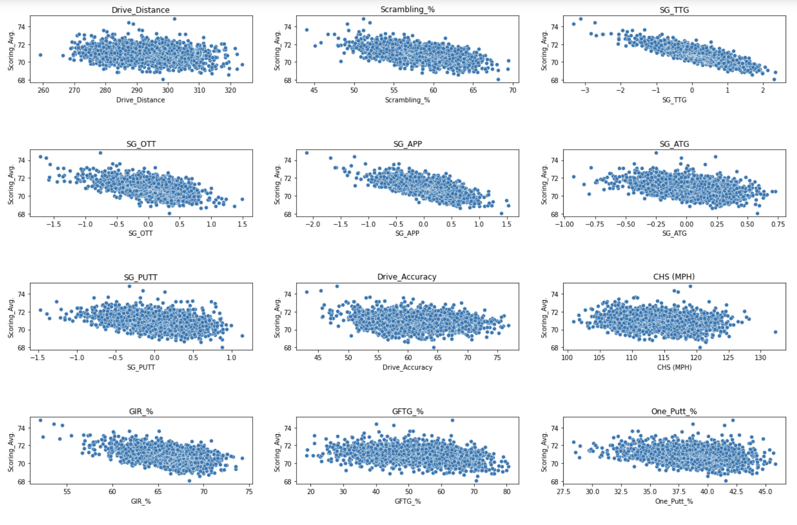
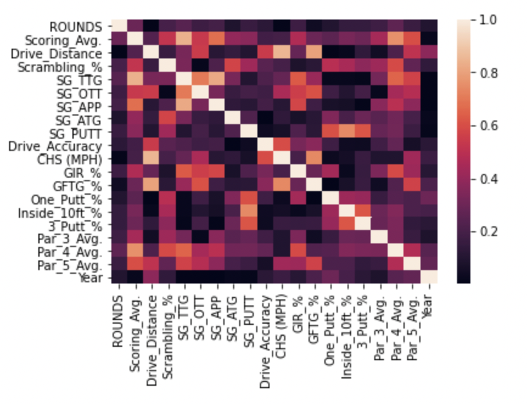
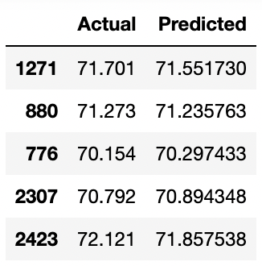
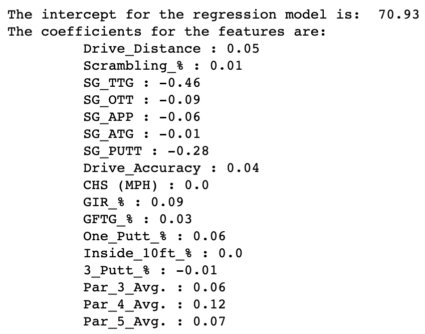
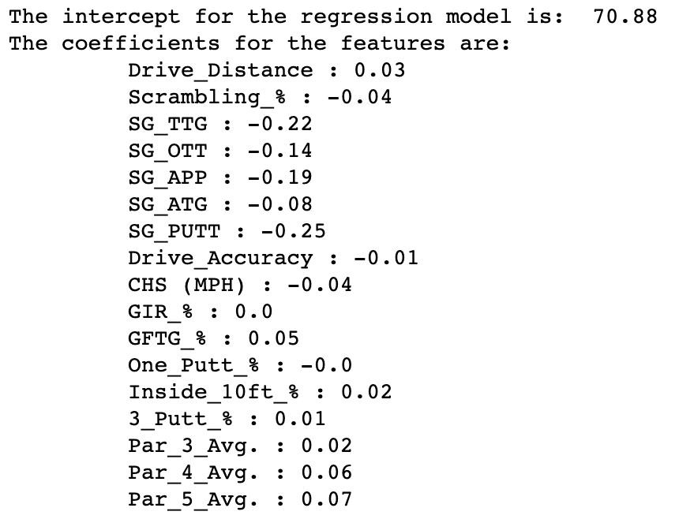

{
 "cells": [
  {
   "cell_type": "markdown",
   "metadata": {},
   "source": [
    "# Changing The Game"
   ]
  },
  {
   "cell_type": "markdown",
   "metadata": {},
   "source": [
    "John Daniels"
   ]
  },
  {
   "cell_type": "markdown",
   "metadata": {},
   "source": [
    ""
   ]
  },
  {
   "cell_type": "markdown",
   "metadata": {},
   "source": [
    "## General Overview"
   ]
  },
  {
   "cell_type": "markdown",
   "metadata": {},
   "source": [
    "Ever since I started this program, I haven’t been practicing as much as I would have liked to for the upcoming fall golf season. Since I will have limited time to sharpen my game before the season starts, I need to know the most important parts of my game to work on. The PGA TOUR provides almost every statistic that they have accumulated from player performance data in the past few decades. I handpicked a large majority of the statistics that I think affect players’ scores the most, based off of my own understanding for the game of golf. I had to web scrape these statisitics individually, merge them together, and concatenize them into one dataset. From there, I created a model that predicts a player's scoring average based on his statisitics from that season. After testing three models, I found that the Ridge model I ran gave me the most accurate predictions. I lowered the original RMSE (Root Mean Squared Error) pretty significantly, and was able to see which variables had the greatest impact on scoring average."
   ]
  },
  {
   "cell_type": "markdown",
   "metadata": {},
   "source": [
    "## Business Problem"
   ]
  },
  {
   "cell_type": "markdown",
   "metadata": {},
   "source": [
    "My stakeholders in this project are myself and any aspiring or experienced golfers. My stakeholders can gain insight on what specific statistics impact PGA TOUR player's scoring averages the greatest, which can be implemented into their own practice to know what skills help lower score the most. My model will use PGA TOUR statistics that I have chosen to analyze to predict a player's scoring average from a specific season. After doing so, I will look into which variables lowered score to the greatest extent."
   ]
  },
  {
   "cell_type": "markdown",
   "metadata": {},
   "source": [
    "## Data Understanding"
   ]
  },
  {
   "cell_type": "markdown",
   "metadata": {},
   "source": [
    "The data comes from https://www.pgatour.com, and each statistic from there helps predict scoring average. All of the variables I will be using to predict scoring average are numeric as well. I web scraped and organized the data by the `PLAYER NAME` column in this notebook here: https://github.com/johndaniels2/PGA-TOUR-Project/blob/main/Web%20Scraping.ipynb."
   ]
  },
  {
   "cell_type": "markdown",
   "metadata": {},
   "source": [
    "### Full List of Variables with Descripitons"
   ]
  },
  {
   "cell_type": "markdown",
   "metadata": {},
   "source": [
    "* `PLAYER NAME` - The name of the golfer\n",
    "* `ROUNDS` - The number of rounds played in the given season\n",
    "* `Scoring_Avg.` - The weighted scoring average which takes the stroke average of the field into account. It is computed by adding a player's total strokes to an adjustment and dividing by the total rounds played. The adjustment is computed by determining the stroke average of the field for each round played. This average is subtracted from par to create an adjustment for each round. A player accumulates these adjustments for each round played.\n",
    "* `Drive_Distance` - The average number of yards per measured drive. These drives are measured on two holes per round. Care is taken to select two holes which face in opposite directions to counteract the effect of wind. Drives are measured to the point at which they come to rest regardless of whether they are in the fairway or not\n",
    "* `Scrambling_%` - The percentage of time a player gets up and down from off the green.\n",
    "* `SG_TTG` (Strokes Gained Tee to Green) - The per round average of the number of Strokes the player was better or worse than the field average on the same course & event minus the Players Strokes Gained putting value.\n",
    "* `SG_OTT` (Strokes Gained Off the Tee) - The number of strokes a player takes from a specific distance off the tee on Par 4 & par 5's is measured against a statistical baseline to determine the player's strokes gained or lost off the tee on a hole.\n",
    "* `SG_APP` (Strokes Gained Approach) - The number of Approach the Green strokes a player takes from specific locations and distances are measured against a statistical baseline to determine the player's strokes gained or lost on a hole.\n",
    "* `SG_ATG` (Strokes Gained Around the Green) - The number of Around the Green strokes a player takes from specific locations and distances are measured against a statistical baseline to determine the player's strokes gained or lost on a hole.\n",
    "* `SG_PUTT` (Strokes Gained Putting) - The number of putts a player takes from a specific distance is measured against a statistical baseline to determine the player's strokes gained or lost on a hole. The sum of the values for all holes played in a round minus the field average strokes gained/lost for the round is the player's Strokes gained/lost for that round. The sum of strokes gained for each round are divided by total rounds played.\n",
    "* `Drive_Accuracy` - The percentage of time a tee shot comes to rest in the fairway (regardless of club).\n",
    "* `CHS (MPH)` (Club Head Speed) - The average speed of the club head on driver swings\n",
    "* `GIR_%` - The percent of time a player was able to hit the green in regulation (greens hit in regulation/holes played). Note: A green is considered hit in regulation if any portion of the ball is touching the putting surface after the GIR stroke has been taken. (The GIR stroke is determined by subtracting 2 from par (1st stroke on a par 3, 2nd on a par 4, 3rd on a par 5))\n",
    "* `GFTG_%` (Going For The Green) - The percentage of time a player hits a par 5's green in two shots.\n",
    "* `One_Putt_%` - The percentage of time a player one-putts.\n",
    "* `Inside_10ft_%` - The percentage of time a player makes a putt inside ten feet.\n",
    "* `3_Putt_%` - The percentage of time a player three putts.\n",
    "* `Par_3_Avg.` - The average score a player makes on a par 3.\n",
    "* `Par_4_Avg.` - The average score a player makes on a par 4.\n",
    "* `Par_5_Avg.` - The average score a player makes on a par 5.\n",
    "* `Year` - The year of the season a player's statistics are from."
   ]
  },
  {
   "cell_type": "markdown",
   "metadata": {},
   "source": [
    "A majority of the code used in this project was inspired by Jonathan Nocek's project on PGA TOUR data. View it here: https://github.com/jonathannocek/pga-data-analysis.git."
   ]
  },
  {
   "cell_type": "markdown",
   "metadata": {},
   "source": [
    "## Data Exploration"
   ]
  },
  {
   "cell_type": "markdown",
   "metadata": {},
   "source": [
    "These histograms below give me a basic idea of the median values for each of the variables in my dataset. If you look closely, you can tell that the players' values are very closely related for the most part."
   ]
  },
  {
   "cell_type": "markdown",
   "metadata": {},
   "source": [
    ""
   ]
  },
  {
   "cell_type": "markdown",
   "metadata": {},
   "source": [
    ""
   ]
  },
  {
   "cell_type": "markdown",
   "metadata": {},
   "source": [
    "My target variable for my model will be `Scoring_Avg.`. These scatter plots below show the relationship each variable has with `Scoring_Avg.`. Depending on the variable, a positive or a negative relationship can mean good things. Based off of my first glance, it seems that `Strokes Gained: Tee To Green` has the strongest correlation with `Scoring_Avg.`."
   ]
  },
  {
   "cell_type": "markdown",
   "metadata": {},
   "source": [
    ""
   ]
  },
  {
   "cell_type": "markdown",
   "metadata": {},
   "source": [
    ""
   ]
  },
  {
   "cell_type": "markdown",
   "metadata": {},
   "source": [
    "I also want to look in and see how well each value correlates with one another on this heatmap below."
   ]
  },
  {
   "cell_type": "markdown",
   "metadata": {},
   "source": [
    ""
   ]
  },
  {
   "cell_type": "markdown",
   "metadata": {},
   "source": [
    "## Modeling"
   ]
  },
  {
   "cell_type": "markdown",
   "metadata": {},
   "source": [
    "Each model I create will come up with predictions for my testing data. Here is an example of what that looked like in my Ridge Regression model."
   ]
  },
  {
   "cell_type": "markdown",
   "metadata": {},
   "source": [
    ""
   ]
  },
  {
   "cell_type": "markdown",
   "metadata": {},
   "source": [
    "I want to know which variables effect scoring average the most in the model. The lower the coeffecient is below, the more it impacts lowering the scoring average. If you look closely, `SG_TTG` makes the largest impact, and `One_Putt_%` has the smallest impact. You would think `Par_4_Avg.` has the smallest impact since its coefficient is the highest. It actually has the opposite effect on `Scoring_Avg.` than most other variables since the higher its value is, the worse it affects `Scoring_Avg.`. The higher score you make on a par 4, the higher your score is."
   ]
  },
  {
   "cell_type": "markdown",
   "metadata": {},
   "source": [
    ""
   ]
  },
  {
   "cell_type": "markdown",
   "metadata": {},
   "source": [
    "I want to see if and which statistics affect scoring average differently in 2022 compared to 2009-2022. I copied the same data processing and modeling I used earlier to do this!"
   ]
  },
  {
   "cell_type": "markdown",
   "metadata": {},
   "source": [
    ""
   ]
  },
  {
   "cell_type": "markdown",
   "metadata": {},
   "source": [
    "My final model ended up being the Ridge Regression model I used. The other two models I created were a Decision Tree Regressor and a Random Forest Regressor."
   ]
  },
  {
   "cell_type": "markdown",
   "metadata": {},
   "source": [
    "## Conclusions"
   ]
  },
  {
   "cell_type": "markdown",
   "metadata": {},
   "source": [
    "The goals of my project were fulfilled! There are few more things I would like to look into in the the future, but I accomplished many things with the model that tests PGA TOUR statistics from 2009-2022.\n",
    "* I learned that `SG_TTG` had a larger impact than `SG_PUTT` on `Scoring_Avg.`. This means that the best ballstrikers have a larger advantage than the best putters overall in a season.\n",
    "* I also learned that `Drive_Accuracy` had a lower impact than most variables. This means that the most accurate players off the tee do not gain much of a scoring advantage compared to other attributes.\n",
    "* Lastly, I learned that `Par_4_Avg.` lowers `Scoring_Avg.` more than any other hole statistic by a significant amount."
   ]
  },
  {
   "cell_type": "markdown",
   "metadata": {},
   "source": [
    "With my model testing data from just 2022, I got some different results on which variables impacted scoring average the most.\n",
    "* I learned that `SG_PUTT` had a larger impact than `SG_TTG` on `Scoring_Avg.`. This means that the best putters have a larger advantage than the best ballstrikers overall in a season.\n",
    "* I also learned that `Par_5_Avg.` lowers `Scoring_Avg.` more than any other hole statistic by a significant amount."
   ]
  },
  {
   "cell_type": "markdown",
   "metadata": {},
   "source": [
    "### Recommendations"
   ]
  },
  {
   "cell_type": "markdown",
   "metadata": {},
   "source": [
    "I trust results from the past year individually a little more in some ways than results combined from 2009-2022. This is because the game has changed a lot in the past decade. The new technology and growing understanding on how to perform better has not only made courses longer, but also harder. Everyone has their own game and struggles to overcome, so to truly get better at golf you must be able to recognize them. Overall, my own game has many great strengths and weaknesses. If I can keep my ballstriking and putting in great shape, then I'll be unstoppable. I may have already known that, but these statistics reteach me this."
   ]
  },
  {
   "cell_type": "markdown",
   "metadata": {},
   "source": [
    "### Future Plans"
   ]
  },
  {
   "cell_type": "markdown",
   "metadata": {},
   "source": [
    "I definitely would like to look into more regression models I can use to predict `Scoring_Avg.`, as well as tuning methods for my Ridge model. I would also gather more statistics to test and see if I can find any that impact `Scoring_Avg.` more than the variables I have already noticed. Lastly, I would love to start keeping track of my entire team's statistics to not only see if they help predict our very own scoring averages, but look at what statistics are hurting our score and contributing to lower our scoring averages."
   ]
  }
 ],
 "metadata": {
  "kernelspec": {
   "display_name": "Python (learn-env)",
   "language": "python",
   "name": "learn-env"
  },
  "language_info": {
   "codemirror_mode": {
    "name": "ipython",
    "version": 3
   },
   "file_extension": ".py",
   "mimetype": "text/x-python",
   "name": "python",
   "nbconvert_exporter": "python",
   "pygments_lexer": "ipython3",
   "version": "3.8.5"
  }
 },
 "nbformat": 4,
 "nbformat_minor": 4
}
